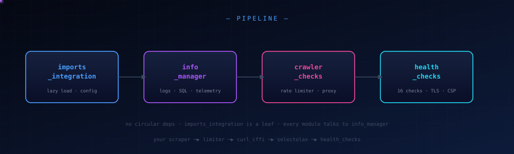
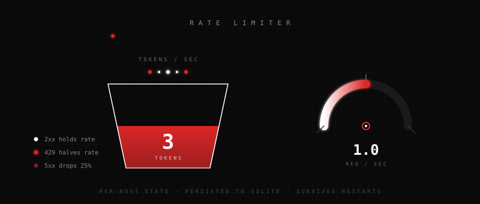

# README

Full replacement for `README.md`. `/thea` structure: title, overview, key concepts, module-by-module detail, examples, connections, open questions. Obsidian/Notion-compatible headings and internal links. Code blocks are fenced. No inline backticks in prose — **bold** carries emphasis instead.

Save to the repo root.

---

<div align="center">


[](https://www.python.org/)
[](LICENSE)
[](CHANGELOG.md)

[](https://github.com/your-handle/crawler_toolkit/actions)
[](https://github.com/your-handle/crawler_toolkit/actions)


**Rate limiting. Health checks. Telemetry. Integration.**
<br/>
Four modules. One toolkit. Zero config to start.


</div>

## Table of Contents

- [[#Overview]]
- [[#Installation]]
- [[#Quickstart]]
- [[#Module Reference]]
  - [[#imports_integration]]
  - [[#info_manager]]
  - [[#crawler_checks]]
  - [[#health_checks]]
- [[#Architecture]]
- [[#Configuration]]
- [[#Examples]]
- [[#Stress Testing]]
- [[#Testing]]
- [[#Project Layout]]
- [[#Design Decisions]]
- [[#Connections]]
- [[#Open Questions]]
- [[#Contributing]]
- [[#License]]

---

## Overview

crawler_toolkit is infrastructure for scrapers that use curl_cffi and selectolax. It sits under your scraper and handles four things that every production scraper eventually needs, and that most scrapers implement badly on the third day of a project:

1. **Rate limiting that respects the server.** Not a fixed sleep. A token bucket per host, adapted from real response headers, persisted across process restarts.
2. **Health checking that sees through challenges.** Sixteen checks that catch the difference between "200 OK with content" and "200 OK with a Cloudflare interstitial."
3. **Telemetry you can query.** Structured logs with deduplication, timestamps, redaction, and a general SQLite store you can run arbitrary SQL against.
4. **Clean integration.** One config object. Lazy imports so the toolkit never becomes a hard dependency of code that doesn't use all of it.

What it is **not**: a scraping framework, a scheduler, a proxy rotator, a distributed crawler, an extraction DSL, or a JS renderer. If you need those, this toolkit is a component inside them, not a replacement.

### Who this is for

Developers who already have a scraping pipeline and want to stop reimplementing rate limiting, health checks, and logging on every new project. If you write scrapers professionally, this is the boring infra you want underneath.

### Who this is not for

Anyone who wants to point a config file at a URL list and get CSV output. This is a library. You write the crawl loop.

---

## Installation

### From PyPI

```bash
pip install crawler-toolkit
```

### From source

```bash
git clone https://github.com/your-handle/crawler_toolkit
cd crawler_toolkit
pip install -e ".[dev]"
```

The editable install is the recommended path for development. It picks up source changes without reinstalling.

### Requirements

| dependency | version | role |
|---|---|---|
| Python | 3.10+ | floor for structural pattern matching and typing |
| curl_cffi | 0.6.0+ | TLS impersonation + HTTP transport |
| selectolax | 0.3.0+ | fast HTML parsing for DOM checks and link extraction |
| pytest | 7.4+ | dev only |
| pytest-asyncio | 0.23+ | dev only |

**Optional**: PyYAML for `.yaml` / `.yml` parsing in the file audit test. The audit degrades gracefully when it's missing — YAML files fall back to raw-text mode.

---

## Quickstart

The minimum viable integration. Make a rate-limited request, check its health, log the outcome.

```python
import asyncio
from crawler_toolkit.crawler_checks import RateLimiter
from crawler_toolkit.health_checks import HealthChecker
from crawler_toolkit.info_manager import get_logger
from crawler_toolkit.imports_integration import require

async def main():
    log = get_logger("app")
    limiter = RateLimiter(default_rate=1.0)
    hc = HealthChecker()
    c = require("curl_cffi")

    async with c.AsyncSession(impersonate="chrome124") as session:
        url = "https://example.com"
        await limiter.acquire(url)
        resp = await session.get(url)
        limiter.observe(url, resp.status_code, dict(resp.headers))
        log.info("fetched", url=url, status=resp.status_code)

    report = await hc.check(url)
    print(report.summary())

asyncio.run(main())
```

That's the whole API surface for the common path. Everything else is optional depth.

<div align="center">

</div>

---

## Module Reference

### imports_integration

**Purpose**: be the front door. Never let the toolkit become a hard dependency of code that doesn't need all of it.

**Key concepts**

- **Lazy module resolution.** Importing crawler_toolkit does not import curl_cffi or selectolax. They're loaded on first access via a lazy proxy.
- **Capability negotiation.** Ask the toolkit what's available before you commit to a code path. **has("curl_cffi")** returns a boolean. **require("curl_cffi")** raises if missing. **optional("curl_cffi")** returns None if missing.
- **Single config surface.** One **ToolkitConfig** dataclass carries every knob across all four modules. One **configure()** call mutates it.

**API**

```python
from crawler_toolkit.imports_integration import (
    require, optional, has,
    ToolkitConfig, get_config, configure, reset_config,
    capabilities, describe, public_api,
    ToolkitError, MissingDependencyError,
    HAS_CURL_CFFI, HAS_SELECTOLAX,
)
```

**Example: check the environment before committing**

```python
from crawler_toolkit.imports_integration import capabilities, describe

print(describe())
# crawler_toolkit capability report
# ==================================
#   curl_cffi                 True
#   selectolax                True
#   python                    3.14.0
#   curl_cffi_version         0.16.3
#   selectolax_version        0.4.11
```

**Example: lazy import with fallback**

```python
from crawler_toolkit.imports_integration import has, require

if has("selectolax"):
    HTMLParser = require("selectolax").parser.HTMLParser
else:
    raise RuntimeError("this scraper requires selectolax")
```

**Example: override config at startup**

```python
from crawler_toolkit.imports_integration import configure

configure(
    log_level="DEBUG",
    default_rate=2.0,
    default_burst=5.0,
    honor_retry_after=True,
    allow_rate_climb=False,
    proxy_provider=lambda host: None,
)
```

**Failure modes**

- Missing curl_cffi at network-call time → **MissingDependencyError** with an install hint.
- Unknown key in **configure()** → **ToolkitError**. Silent typos are worse than loud ones.

---

### info_manager

**Purpose**: logging, telemetry, a general SQLite store, and self-tests. Four concerns behind one facade.

**Key concepts**

- **Bounded-LRU dedup.** Identical log lines within a time window collapse into one row with an incrementing count. 10,000 identical lines become one row with **count=10000**.
- **Redaction before write.** Values matching **token**, **key**, **secret**, **password**, **auth**, **apikey**, **api_key** in key-value strings are replaced with **\*\*\***.
- **One SQLite file.** Three toolkit tables — **logs**, **telemetry**, **host_state** — plus whatever you create. Shared connection, shared transactions.
- **Passenger, not dependency.** If the DB file can't be written, the toolkit falls back to an in-memory ring buffer and writes a warning to stderr. Rate limiting and health checks keep working.

**API**

```python
from crawler_toolkit.info_manager import (
    get_logger, log, query, execute,
    Timer, trace, run_self_tests, get_store, configure_logging,
    Level, Store, LogRecord,
)
```

**Example: structured logging with dedup**

```python
from crawler_toolkit.info_manager import get_logger

log = get_logger("scraper")

for i in range(10000):
    log.info("retrying page", url="https://x.com", attempt=3)
    # All 10000 calls collapse into one log row with count=10000.
```

**Example: timing a block**

```python
from crawler_toolkit.info_manager import Timer

with Timer("fetch.detail_page"):
    # the timer logs the duration and records a telemetry row
    resp = await session.get(url)
```

**Example: arbitrary SQL against the store**

```python
from crawler_toolkit.info_manager import execute, query

execute("CREATE TABLE IF NOT EXISTS pages (url TEXT, status INT, ts REAL)")
execute("INSERT INTO pages VALUES (?, ?, ?)", (url, 200, time.time()))

recent_errors = query(
    "SELECT url FROM pages WHERE status >= 400 ORDER BY ts DESC LIMIT 50"
)
```

**Example: self-diagnostics**

```python
from crawler_toolkit.info_manager import run_self_tests

for name, (ok, detail) in run_self_tests().items():
    print(f"{name}: {'OK' if ok else 'FAIL'} — {detail}")
```

Checks run: dedup correctness, dedup eviction, redaction, store round-trip, logger emission.

**Failure modes**

- SQLite write fails → ring-buffer fallback, no exception, stderr warning.
- Dedup map full → oldest entries evicted first. No unbounded growth.

---

### crawler_checks

**Purpose**: the token bucket that respects the server.

**Key concepts**

- **Per-host token bucket.** Each host gets its own bucket with its own rate and burst. A slow host does not slow down a fast host.
- **Adaptive from real signals.** Response headers drive the rate. **429** with **Retry-After** triggers a cooldown and halves the rate. **5xx** drops the rate by 25%. **2xx** holds. Server-declared limits via **RateLimit-*** (RFC 9331 draft) or **X-RateLimit-*** are adopted outright.
- **Conservative by default.** A heuristic "climb" (rate *= 1.05 after 5 consecutive OKs) exists but is **off** unless you explicitly enable it. Without a server invitation, the rate never exceeds the configured default.
- **Persistent learning.** Rate state writes to the SQLite store at **~/.cache/crawler_toolkit/toolkit.db**. Process restarts do not reset the limiter.
- **Proxy hook.** You supply a function. The toolkit asks it per host. No proxy rotation built-in — you own the policy.

**API**

```python
from crawler_toolkit.crawler_checks import (
    RateLimiter, HostState, get_limiter, reset_limiters,
)
```

**Example: async pattern**

```python
limiter = RateLimiter(default_rate=1.0)

async with c.AsyncSession(impersonate="chrome124") as session:
    for url in urls:
        await limiter.acquire(url)
        resp = await session.get(url)
        limiter.observe(url, resp.status_code, dict(resp.headers))
```

**Example: sync pattern**

```python
limiter = RateLimiter(default_rate=1.0)
limiter.acquire_sync("https://api.example.com")
resp = requests.get(url)
limiter.observe(url, resp.status_code, dict(resp.headers))
```

**Example: proxy per host**

```python
def pick_proxy(host: str) -> str | None:
    if host.endswith(".onion"):
        return "socks5://127.0.0.1:9050"
    if host in premium_hosts:
        return my_pool.premium_for(host)
    return None

limiter = RateLimiter(proxy_provider=pick_proxy)
proxy = limiter.proxy_for(url)  # returns whatever pick_proxy returned
```

**Example: inspect learned state**

```python
state = limiter.state("https://en.wikipedia.org")
# {
#   "host": "en.wikipedia.org",
#   "rate": 1.0,
#   "burst": 1.0,
#   "tokens": 0.42,
#   "cooldown_until": 0.0,
#   "total_requests": 47,
#   "total_429s": 0,
#   "total_5xx": 0,
#   "last_status": 200,
# }
```

**Rate control knobs**

| parameter | default | meaning |
|---|---|---|
| default_rate | 1.0 | starting req/sec per host |
| default_burst | 3.0 | maximum tokens in the bucket |
| min_rate | 0.05 | rate never drops below this |
| max_rate | 20.0 | rate never exceeds this |
| max_retry_after | 3600.0 | Retry-After values are clamped to this many seconds |
| honor_retry_after | True | obey Retry-After header |
| allow_rate_climb | False | heuristic speed-up when server is silent |

**Failure modes**

- Malicious **Retry-After: 999999** → clamped to **max_retry_after**.
- Malicious **Retry-After: -5** → ignored, treated as "no hint."
- Corrupted state file → reset to defaults, log warning.

<div align="center">

</div>

---

### health_checks

**Purpose**: sixteen checks that distinguish "200 OK" from "200 OK but actually broken."

**Key concepts**

- **Sixteen checks per URL.** Each returns a **CheckResult** with **ok**, **message**, **severity**, **value**, and **duration_ms**.
- **Severity levels.** **info**, **low**, **medium**, **high**, **critical**. A report's **ok** field is True only if no non-info check failed.
- **Challenge detection.** Body-text scan for Cloudflare, DDoS-Guard, and generic JS-wall markers. Detects 403/503 with short bodies as probable blocks.
- **Six security headers.** HSTS, CSP, X-Content-Type-Options, X-Frame-Options, Referrer-Policy, Permissions-Policy. Reports missing.
- **Trackers and ads.** Scans for known third-party domains.

**The sixteen checks**

| check | what it catches |
|---|---|
| status | non-2xx and non-3xx responses |
| response_time | slow origin, network issues |
| ssl | expiring or expired certificates |
| redirects | HTTPS-to-HTTP downgrades, redirect loops |
| challenge_page | Cloudflare, DDoS-Guard, JS-wall markers |
| dom | empty or malformed HTML |
| content_hash | change detection across runs |
| content_size | truncated or bloated responses |
| required_headers | user-declared must-haves |
| security_headers | HSTS, CSP, XFO, XCTO, Referrer-Policy, Permissions-Policy |
| cookie_flags | missing Secure, HttpOnly, or SameSite |
| hsts | max-age below 180 days |
| csp | unsafe-inline or unsafe-eval |
| trackers | Google Analytics, GTM, Hotjar, Mixpanel, Segment, and more |
| ads | AdSense, Criteo, Taboola, Outbrain, and more |
| dns | resolution failures |

**API**

```python
from crawler_toolkit.health_checks import (
    HealthChecker, CheckResult, HealthReport, CheckContext,
    check_url, ALL_CHECKS,
)
```

**Example: full check**

```python
hc = HealthChecker()
report = await hc.check("https://example.com")

print(report.summary())
# HealthReport https://example.com [200] 431ms ok=False
#   [PASS] status: 200
#   [PASS] response_time: 431ms
#   [PASS] ssl: valid, 82d left
#   [PASS] redirects: 0 hops
#   [PASS] challenge_page: no challenge markers
#   [PASS] dom: 4 top-level nodes
#   [PASS] content_hash: a3f4b8c2e1d90671
#   [PASS] content_size: 1256B
#   [PASS] required_headers: none required
#   [FAIL] security_headers: missing 3/6
#   [PASS] cookie_flags: no cookies set
#   [FAIL] hsts: missing HSTS
#   [FAIL] csp: missing CSP
#   [PASS] trackers: 0 trackers
#   [PASS] ads: 0 ad networks
#   [PASS] dns: example.com → 93.184.216.34
```

**Example: subset of checks**

```python
from crawler_toolkit.health_checks import HealthChecker, _check_status, _check_response_time

fast = HealthChecker(checks=[_check_status, _check_response_time])
report = await fast.check(url)  # two checks, ~50ms, no SSL handshake
```

**Example: programmatic access**

```python
report = await hc.check(url)

# fails is a list of CheckResult
fails = [r for r in report.results if not r.ok]
for r in fails:
    print(f"{r.name}: {r.message} (severity: {r.severity})")

# dump to dict for JSON
data = report.to_dict()
```

**Configuration**

| parameter | default | meaning |
|---|---|---|
| response_time_warn_ms | 1500.0 | anything slower is "slow" |
| response_time_fail_ms | 5000.0 | anything slower is "very slow" |
| content_size_min | 64 | below this size, content is flagged |
| content_size_max | 50 MB | above this size, content is flagged |
| challenge_markers | 6 markers | body-text substrings that indicate a wall |
| tracker_markers | 10 domains | GA, GTM, Hotjar, Mixpanel, etc. |
| ad_markers | 10 domains | AdSense, Criteo, Taboola, etc. |
| required_headers | () | user-supplied must-have headers |
| security_headers | 6 headers | which security headers to check |
| parser | lexbor | selectolax backend for DOM checks |

**Failure modes**

- curl_cffi cannot connect → report **ok=False**, one **request** check fails with **critical** severity.
- selectolax missing → **dom** check skips with a message, does not crash.
- Malformed HTML → **dom** reports parse failure at **medium** severity.

---

## Architecture

### Module dependency graph

```
imports_integration   (leaf — no internal deps)
        ▲
info_manager          (used by all for telemetry)
        ▲
crawler_checks        (+ curl_cffi)
        ▲
health_checks         (+ curl_cffi + selectolax)
```

No cycles. **imports_integration** never top-level imports the others — that is the whole point of it existing.

### Critical path

**imports_integration** → **info_manager** → **crawler_checks** → **health_checks**.

Everything below **info_manager** uses it for logging and telemetry. Everything above depends on **crawler_checks** for limiting.

### Trust boundaries

1. **Your code.** Trusted. You control it.
2. **Target sites.** Untrusted. Headers may lie, bodies may be challenges, certificates may be fake.
3. **Local filesystem.** Semi-trusted. The SQLite state file is user-writable.

### Failure isolation

Every module has a defined degradation path:

| failure | degraded behavior |
|---|---|
| curl_cffi missing | package still imports; only network functions raise |
| selectolax missing | health checks skip DOM-specific checks |
| SQLite write fails | telemetry falls back to memory ring buffer |
| state file corrupted | limiter resets to defaults, logs warning |
| proxy_provider raises | limiter logs warning, proceeds without proxy |
| DNS resolution fails | one host's bucket doesn't poison others |

---

## Configuration

All config lives in one dataclass. Mutate it once at startup, read it anywhere.

```python
from crawler_toolkit.imports_integration import configure

configure(
    # logging
    log_level="INFO",
    db_path=None,                    # None → ~/.cache/crawler_toolkit/toolkit.db
    log_dedup_max=4096,
    log_to_stderr=True,
    log_ring_size=1024,

    # rate limiting
    default_rate=1.0,
    default_burst=3.0,
    min_rate=0.05,
    max_rate=20.0,
    max_retry_after=3600.0,
    honor_retry_after=True,
    allow_rate_climb=False,
    proxy_provider=None,
    impersonate="chrome124",

    # health checks
    response_time_warn_ms=1500.0,
    response_time_fail_ms=5000.0,
    content_size_min=64,
    content_size_max=50 * 1024 * 1024,
    required_headers=(),
    parser="lexbor",
)
```

**Unknown keys raise ToolkitError**. This is deliberate — a silent config typo is a bug that shows up three days later.

**reset_config()** returns everything to defaults. Useful in tests.

---

## Examples

### Example 1 — Polite single-host crawl

```python
import asyncio
from crawler_toolkit.crawler_checks import RateLimiter
from crawler_toolkit.info_manager import get_logger
from crawler_toolkit.imports_integration import require, configure

async def main():
    configure(log_level="INFO", default_rate=1.0)
    log = get_logger("crawl")
    limiter = RateLimiter()
    c = require("curl_cffi")

    urls = [f"https://example.com/page/{i}" for i in range(20)]

    async with c.AsyncSession(impersonate="chrome124") as session:
        for url in urls:
            await limiter.acquire(url)
            try:
                resp = await session.get(url, timeout=10)
                limiter.observe(url, resp.status_code, dict(resp.headers))
                log.info("ok", url=url, status=resp.status_code)
            except Exception as e:
                log.error("failed", url=url, error=str(e))

asyncio.run(main())
```

### Example 2 — Health-check a list of URLs

```python
import asyncio
from crawler_toolkit.health_checks import HealthChecker

async def main():
    hc = HealthChecker()
    urls = [
        "https://example.com",
        "https://github.com",
        "https://news.ycombinator.com",
    ]
    for url in urls:
        report = await hc.check(url)
        print(f"{url}: {'PASS' if report.ok else 'FAIL'}")
        for r in report.results:
            if not r.ok:
                print(f"  - {r.name}: {r.message}")

asyncio.run(main())
```

### Example 3 — Query the telemetry store

```python
from crawler_toolkit.info_manager import get_store

store = get_store()

# slowest health checks in the last hour
rows = store.query("""
    SELECT tags, value_num
    FROM telemetry
    WHERE key = 'health.check' AND ts > ?
    ORDER BY value_num DESC
    LIMIT 10
""", (time.time() - 3600,))

for row in rows:
    print(f"{row['tags']}: {row['value_num']:.0f}ms")
```

### Example 4 — Custom health check

```python
from crawler_toolkit.health_checks import CheckResult, HealthChecker

def check_json_valid(ctx) -> CheckResult:
    if "application/json" not in ctx.headers.get("content-type", ""):
        return CheckResult("json_valid", True, "not json")
    try:
        import json
        json.loads(ctx.text)
        return CheckResult("json_valid", True, "parseable")
    except Exception as e:
        return CheckResult("json_valid", False, str(e), severity="medium")

hc = HealthChecker(checks=[check_json_valid])
report = await hc.check("https://api.example.com/data")
```

### Example 5 — Rotating proxies (external)

```python
from crawler_toolkit.crawler_checks import RateLimiter

class ProxyPool:
    def __init__(self, proxies):
        self.proxies = proxies
        self.idx = 0
    def get_for(self, host: str):
        p = self.proxies[self.idx % len(self.proxies)]
        self.idx += 1
        return p

pool = ProxyPool(["http://p1:8080", "http://p2:8080"])
limiter = RateLimiter(proxy_provider=pool.get_for)

# Now every request through limiter.request() gets a rotating proxy.
```

---

## Stress Testing

Two harnesses ship with the toolkit. Both write to a single JSONL file per run — every metric, every toolkit log line, every telemetry row, all in one place.

### fixture_stress.py

Runs against a local HTTP server with configurable routes. Five phases: warmup, log storm, limiter accuracy, health throughput, end-to-end crawl. No network access. Reproducible numbers on any machine.

```bash
python stress/fixture_stress.py
python stress/fixture_stress.py --tasks 64 --iterations 500
python stress/fixture_stress.py --phases log_storm --tasks 128 --iterations 1000
```

### heavy_stress.py

Runs a real HTML crawl. Six phases: warmup, seed, crawl, health, limiter, network probe. Defaults to a bounded Wikipedia crawl with `chrome124` impersonation.

```bash
python stress/heavy_stress.py --max-requests 200 --max-seconds 120
python stress/heavy_stress.py --seeds 5 --phases warmup,seed,crawl --out smoke.jsonl
```

**Ethical note**: the Wikipedia harness identifies itself with a real User-Agent containing a contact URL. The WMF User-Agent policy requires this. Set **CONTACT** at the top of the file before running.

### Reading the output

```bash
grep '"event":"crawl"' stress_report.jsonl | python -m json.tool
grep '"event":"summary"' stress_report.jsonl | tail -1
```

Every phase records latency distributions (p50, p95, p99, max), status code counts, error counts, and RSS memory delta.

---

## Testing

### Standard pytest run

```bash
pytest
```

Runs the offline suite. Network-marked tests are skipped by default.

### With network

```bash
pytest -m network
```

Hits a small number of real endpoints for smoke testing. Not part of CI.

### Compressed audit

```bash
python tests/test_files.py
```

Runs eight sections: package layout, import smoke, default config audit, format loaders (28 formats), edge cases, concurrency (8 threads), volume (5000-line JSONL), summary. Exit code 0 on all-pass, 1 on any failure. Usable as a pre-commit gate.

### Writing tests for your scraper

The toolkit ships a **conftest.py** fixture that isolates the store per test:

```python
@pytest.fixture(autouse=True)
def _fresh_toolkit(tmp_path, monkeypatch):
    # each test gets its own SQLite file
    ...
```

Any test that uses crawler_toolkit gets an isolated config, store, and limiter automatically.

---

## Project Layout

```
crawler_toolkit/
├── crawler_toolkit/
│   ├── __init__.py                  # lazy re-exports
│   ├── imports_integration.py       # config, capabilities, require/optional
│   ├── info_manager.py              # logging, SQLite store, self-tests
│   ├── crawler_checks.py            # rate limiter, header parsing
│   └── health_checks.py             # 16 checks, runner
├── tests/
│   ├── conftest.py                  # isolated toolkit per test
│   ├── test_imports_integration.py
│   ├── test_info_manager.py
│   ├── test_crawler_checks.py
│   ├── test_health_checks.py
│   └── test_files.py                # 8-section audit
├── stress/
│   ├── fixture_stress.py            # local server, 5 phases
│   └── heavy_stress.py              # real crawl, 6 phases
├── assets/
│   ├── header.svg                   # README header
│   ├── pipeline.svg                 # module diagram
│   ├── ratelimiter.svg              # token bucket visualization
│   ├── divider.svg                  # section break
│   └── logo.svg                     # repo avatar
├── examples/
│   └── quickstart.py
├── .github/
│   ├── workflows/
│   │   ├── test.yml
│   │   └── lint.yml
│   ├── ISSUE_TEMPLATE/
│   ├── dependabot.yml
│   ├── SECURITY.md
│   ├── CODEOWNERS
│   └── FUNDING.yml
├── pyproject.toml
├── CHANGELOG.md
├── README.md
└── .gitignore
```

---

## Design Decisions

A running list of "why we did it this way."

### Async core, sync facade

Crawlers want concurrency. Scripts want simplicity. Rather than pick one, **RateLimiter** exposes both **acquire** (async) and **acquire_sync** (blocking). The async implementation is the source of truth; the sync version is a thin wrapper.

**Trade-off**: two code paths to maintain. **Acceptable because**: the sync version is 12 lines.

### Telemetry as a passenger, not a dependency

If the SQLite file can't be written — disk full, permissions, corruption — the toolkit doesn't fail. It logs to stderr and keeps going.

**Trade-off**: silent telemetry loss under disk pressure. **Acceptable because**: a rate limiter that stops limiting because its log file is full is worse than a rate limiter that keeps limiting and loses telemetry.

### Per-host state, never global

A DNS outage takes down every host at once. If the limiter interpreted that as "the network is slow, back off globally," one broken host would poison every other host's pacing.

**Trade-off**: more state to persist. **Acceptable because**: state is a small JSON blob per host in SQLite.

### Conservative rate defaults

The rate limiter respects **Retry-After** and clamps malicious values to 1 hour. The heuristic speed-up is off by default.

**Trade-off**: crawls are slower. **Acceptable because**: "crawls get slower" is a much better failure mode than "you got IP-banned from Cloudflare on day one."

### Single SQLite file, not JSONL

Logs, telemetry, and host state share one SQLite file. Queryable with SQL. Persisted across restarts.

**Trade-off**: SQLite write contention under high load. **Acceptable because**: the store runs in a thread executor and writes are batched. If contention becomes a problem, the store can be swapped for an async queue without changing the API.

### No built-in retries

The limiter observes responses and paces the next call. It does not retry.

**Trade-off**: you write your own retry loop. **Acceptable because**: retry semantics (which errors, how many times, backoff shape) vary per project. The toolkit provides the *limit*, not the *retry policy*.

### No proxy rotation

The toolkit accepts a **proxy_provider** callable and asks it per host. It does not rotate.

**Trade-off**: you supply the pool. **Acceptable because**: proxy pools are wildly different per user (free lists, paid APIs, SOCKS5 over Tor, per-site routing). Any rotation policy the toolkit picked would be wrong for 80% of users.

---

## Connections

Related projects and concepts, for deeper reading.

### Direct dependencies

- **[[curl_cffi]]** — TLS impersonation. The toolkit wraps it; it does not replace it.
- **[[selectolax]]** — fast HTML parser with lexbor and modest backends.
- **[[SQLite]]** — the store backend.

### Conceptual predecessors

- **[[Scrapy]]** — a full framework. The toolkit is what you'd build if you only wanted Scrapy's rate limiting and middleware layers.
- **[[HTTPX]]** — modern async HTTP. curl_cffi is preferred for scrapers because of TLS fingerprinting.
- **[[robots.txt]]** — the toolkit does not fetch or honor robots.txt automatically. You should.

### Related reading

- **[[RFC 6585]]** — the origin of HTTP 429.
- **[[RFC 9331 draft]]** — the RateLimit-* header family.
- **[[WMF User-Agent policy]]** — what a polite crawler UA looks like.
- **[[Cloudflare bot management]]** — what the challenge_page check is trying to detect.
- **[[Structured logging]]** — the philosophy behind the dedup layer.

### Downstream patterns

- **A crawler with the toolkit**: curl_cffi + limiter + selectolax + store. The toolkit handles three of those four.
- **A monitoring service with the toolkit**: periodic health checks against your own endpoints, telemetry to the store, alerts on failure patterns.
- **A webhook receiver with the toolkit**: rate-limit incoming requests, log deduplicated events, health-check upstream dependencies.

---

## Open Questions

Live issues that either need follow-up or are deliberately deferred.

### Known gaps

- **Health checks do not feed the limiter.** When **HealthChecker** makes a request, it does not call **limiter.observe**. A 429 during a health check does not affect the limiter's learned rate. Fix requires an API change — passing the limiter into the checker or returning status+headers to the caller.
- **DB state persists across runs from the same **--out****. Running a stress harness twice reuses the same SQLite file. Second run inherits the first run's limiter state.
- **No cross-process coordination.** Two processes hitting the same host each maintain their own in-memory state. The SQLite store syncs on write, but a running process does not see another process's updates until it reloads.
- **Blocking socket calls in health checks.** **\_check_ssl** and **\_check_dns** use blocking socket calls inside async code. Under concurrent load, they serialize the event loop. Fix is straightforward (**await asyncio.to_thread**), deferred for now.

### Design questions under consideration

- **Should the heuristic rate climb exist at all?** Even off-by-default, it is a foot-gun. Removing it is a small breaking change.
- **Should health checks be a subclass or a callable list?** Currently a list of check functions. Subclassing would allow stateful checks (running hashes across runs).
- **Should the toolkit ship a robots.txt parser?** Currently the responsibility is on the caller. A tiny fetch + parse + cache might be worth it.
- **Is one SQLite file the right shape?** Per-project, per-run, or per-host files each have arguments. Currently one file, shared.

### Open research

- **TLS fingerprint stability.** **impersonate="chrome124"** will eventually become stale. curl_cffi updates periodically. The toolkit should detect "this impersonation target is no longer supported" and warn.
- **Distributed rate limiting.** A Redis-backed variant would allow multiple processes to share a bucket. Out of scope for v0.1.
- **Adaptive health check selection.** Running all 16 checks on every URL is wasteful. A "quick pass" (status + time only) followed by deep checks on failure might be the right default.

---

## Contributing

Issues and pull requests are welcome.

### Before opening a PR

1. Run **pytest** and confirm all tests pass.
2. Run **python tests/test_files.py** and confirm all eight sections pass.
3. Match the existing style. The codebase is deliberately terse.
4. Every new public function needs a test.
5. Every new config field needs a line in **ToolkitConfig** and a check in **test_files.py**.
6. Update **CHANGELOG.md** under **Unreleased**.

### Style notes

- No docstrings on private functions. Public functions get one-line docstrings.
- Type hints on everything public. Nothing on private callbacks.
- Comments explain **why**, not **what**. If the code says it, the comment doesn't.
- Prefer **from \_\_future\_\_ import annotations** and modern typing.
- Async code uses **asyncio**. No **threading** except where explicitly documented.
- Tests use **pytest** and **pytest-asyncio** with **asyncio_mode=auto**.

### Reporting bugs

Open an issue with:
- Minimal reproduction
- Environment: Python version, curl_cffi version, selectolax version, OS
- Expected vs. actual behavior
- Traceback if applicable

### Reporting security issues

See **.github/SECURITY.md** for private disclosure.

---

## License

MIT. See **LICENSE** for details.

<div align="center">


**Built for scrapers that need to behave.**

<sub>If this saved you an IP ban, a star helps.</sub>


</div>

---